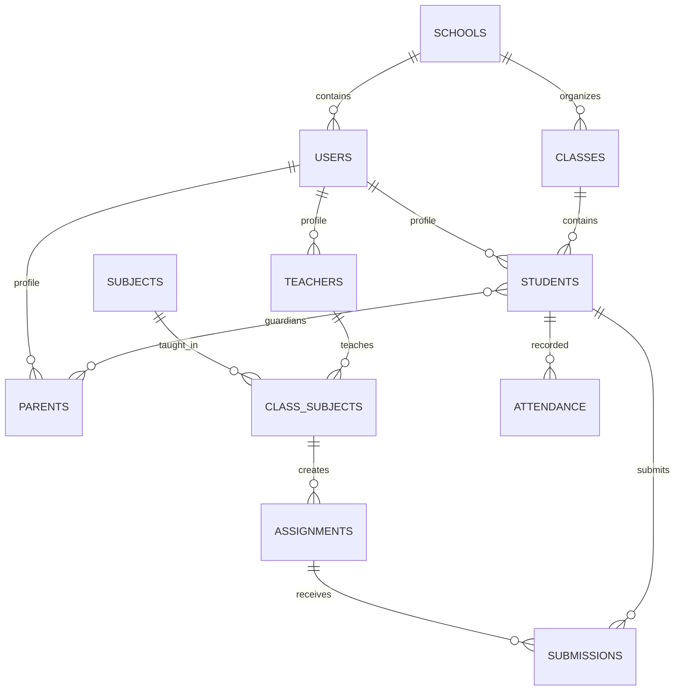

# Database ER Diagram

```mermaid
erDiagram

SCHOOLS ||--o{ USERS : contains
USERS ||--o{ STUDENTS : profile
USERS ||--o{ TEACHERS : profile
USERS ||--o{ PARENTS : profile

STUDENTS }o--o{ PARENTS : guardians

SCHOOLS ||--o{ CLASSES : organizes
CLASSES ||--o{ STUDENTS : contains

SUBJECTS ||--o{ CLASS_SUBJECTS : taught_in
TEACHERS ||--o{ CLASS_SUBJECTS : teaches

CLASS_SUBJECTS ||--o{ ASSIGNMENTS : creates
ASSIGNMENTS ||--o{ SUBMISSIONS : receives

STUDENTS ||--o{ SUBMISSIONS : submits
STUDENTS ||--o{ ATTENDANCE : recorded
```
