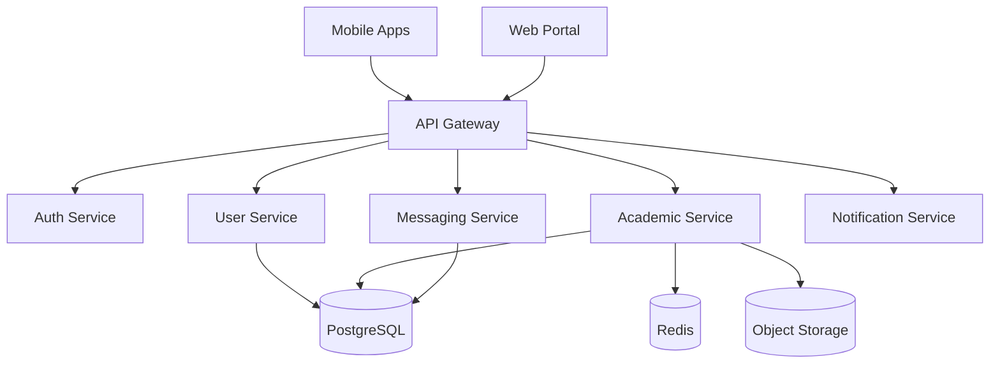

# System Architecture Diagram

```mermaid
flowchart TB

MobileApps[Mobile Apps]
WebPortal[Web Portal]

Gateway[API Gateway]

Auth[Auth Service]
Users[User Service]
Academic[Academic Service]
Messaging[Messaging Service]
Notify[Notification Service]

DB[(PostgreSQL)]
Cache[(Redis)]
Storage[(Object Storage)]

MobileApps --> Gateway
WebPortal --> Gateway

Gateway --> Auth
Gateway --> Users
Gateway --> Academic
Gateway --> Messaging
Gateway --> Notify

Users --> DB
Academic --> DB
Messaging --> DB

Academic --> Cache
Academic --> Storage
```
